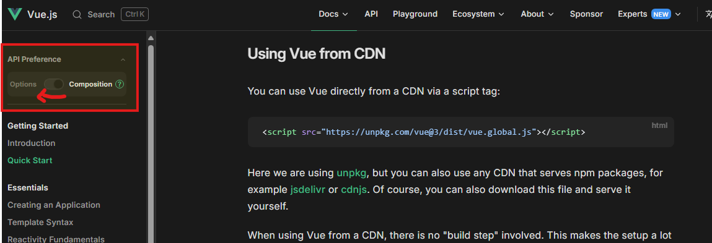
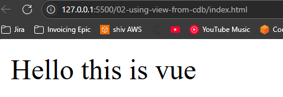
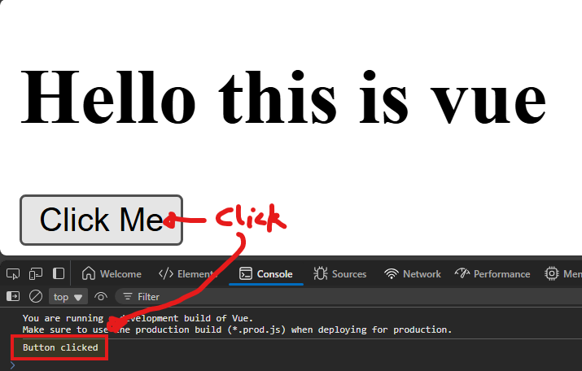
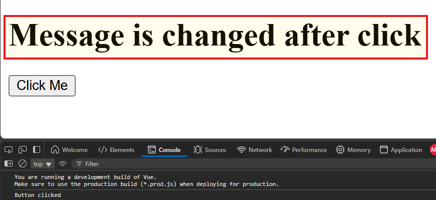

# 🧠2 Using Vue via CDN

## 🟥 2.1 Display State in App

* I open up the quickstart guide for [Using Vue from CDN](https://vuejs.org/guide/quick-start#using-vue-from-cdn):
* I toggle the `API Preference` from Composition to Options:

* I find the script tag to use Vue via CDN:
   ```js
   <script src="https://unpkg.com/vue@3/dist/vue.global.js"></script>
   ```

* I create a HTML file in this folder `index.html` with following content:
   ```html
   <!DOCTYPE html>
   <html lang="en">
      <head>
         <meta charset="UTF-8">
         <meta name="viewport" content="width=device-width, initial-scale=1.0">
         <script src="https://unpkg.com/vue@3/dist/vue.global.js"></script>
         <title>Vue Test</title>
         
      </head>
      <body>
         
      </body>
   </html>
   ```


* Within the `body` tag, I wrote a div with an ID of `app` (note this value is what will be used to mount the app in the Vue JS):
   ```js
   <div id="app"></div>
   ```
* Below this, I define my script tag and define my `app` variable:
   ```js
   <script>
      const app = Vue.createApp({})
   </script>
   ```
* Within the `.createApp()` call, I create a data function returns my STATE:
   ```js
   const app = Vue.createApp({
      data() {
         return {
            message: "Hello this is vue",
         }
      }
   });
   ```
* I then call the `.mount()` method, which instructs which element to mount the app to
   ```js
   app.mount('#app');
   ```
* Finally, I call the `message` from my data from within the render:
   ```js
   <div id="app">{{message}}</div>
   ```
* This is what it looks like if I open the `index.html` via Live server:
   

## 🟥 2.2  Defining Behavior in App
* I want to add a button which when clicked will log a message to the console 💡
* I need to add my button within the `#app` div (the button will not function otherwise 😅)
* I put the `message` into a header and create the button using `@click` attribute to call a function which is to be defined:
   ```html
   <div id="app">
      <h1>{{message}}</h1>
      <button @click="clickMe">Click Me</button>
   </div>
   ```

* To introduce BEHAVIOR to my app, I define a `methods()` function in my App
   ```js
   const app = Vue.createApp({
      data() {
         return {
            message: "Hello this is vue",
         }
      },
      methods: {
         clickMe() {
            console.log("Button clicked");
         }
      }
   });
   ```
* Now, when I click the button the console is logged:
   

* The methods property also lets us MODIFY STATE, I can update the message using the `this` keyword:
   ```js
   clickMe() {
      console.log("Button clicked");
      this.message = 'Message is changed after click';
   }
   ```
* Now the text in the DOM is also updated upon click of button:
   