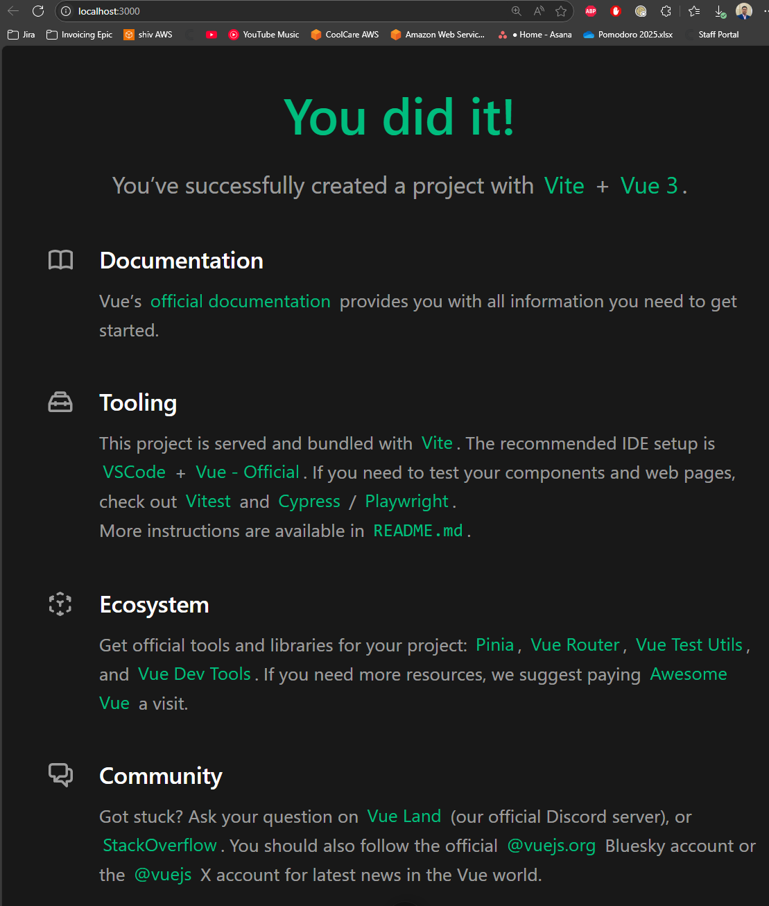

# 🧠 3 Using Vue via Create View

## 🟥 3.1 Creating and Building Example Vue Project
* From the terminal, I navigate to this folder.
* I call the following command:
   ```sh
   npm create vue@latest vue-crash-2025
   ```
* The terminal asks `Select features to include`, I select none for all the options (just pressed enter 3 times)
* For `Skip all example code and starte with a blank Vue project` I enter `No`
* The folder is created [here](./vue-crash-2025/)
* The contents of this folder:

   
* I open this folder in VSCode, and install the Vue extension in market place (Vue (Official))
* Looking at the `package.json`:
  - we can see dependency for `vue`
  - We have `vite` as a devDependency
  - For scripts, we have `dev` which runs the local dev server, `build` for creating production buildm, and `preview` for previewing production build
* The `vite.config.js` file consists of the following:
   ```js
   // https://vite.dev/config/
   export default defineConfig({
   plugins: [
      vue(),
      vueDevTools(),
   ],
   resolve: {
      alias: {
         '@': fileURLToPath(new URL('./src', import.meta.url))
      },
   },
   })
   ```
* The author does not like the default server port of 5713, so he overrides it to 3000:
   ```js
   server: {
      port: 3000
   },
   ```
* Looking at `index.html`:
   ```html
   <!DOCTYPE html>
   <html lang="">
   <head>
      <meta charset="UTF-8">
      <link rel="icon" href="/favicon.ico">
      <meta name="viewport" content="width=device-width, initial-scale=1.0">
      <title>Vite App</title>
   </head>
   <body>
      <div id="app"></div>
      <script type="module" src="/src/main.js"></script>
   </body>
   </html>
   ```
* I rename the title to `Vue Jobs`:
   ```html
   <title>Vue Jobs</title>
   ```

### 🔴 Building the Example Project

* I change directory into the `vue-crash-2025` folder, and I run the dev script via npm:
   ```sh
   npm run dev
   ```
* I get an error:
   ```sh
   > vue-crash-2025@0.0.0 dev
   > vite

   'vite' is not recognized as an internal or external command, operable program or batch file.
   ```
* I fix this by running `npm install`
* I rerun the dev script and get the following in the console showing its successful
* Now if I navigate to `localhost:3030`, I see the following page showing that I've successfully created and built the project:

   